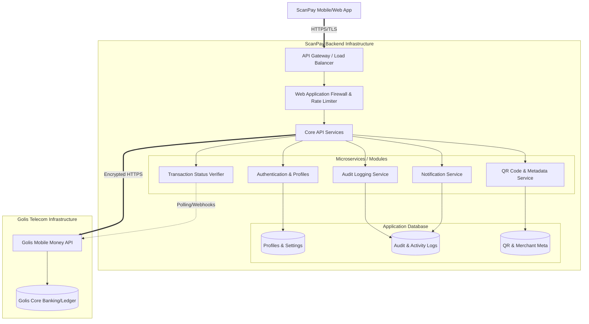

# ScanPay Architecture & Security Model

## 1. Overview
ScanPay is a client application and user interface that connects to the official Golis Mobile Money API. **Crucially, ScanPay is not a digital wallet or financial ledger.** It does not store, hold, custody, settle, or manage user funds. All financial truths (balances, ledgers, settlements) remain firmly within the Golis infrastructure.

ScanPay is designed to act strictly as an API client, providing users with a modern interface for viewing balances, sending payments, scanning/generating QR codes, and receiving merchant analytics.

## 2. System Architecture Diagram

## 3. Core Backend Components

### A. Core API Services
Proxy endpoints that map ScanPay UI actions to the Golis API while enriching the experience with non-financial metadata.

### B. Transaction Status Verifier
Network failures can happen between ScanPay, the payment gateway, and Golis. 
- **Mechanism:** If an API call times out or returns an ambiguous status, this background service queries the Golis API using the `TransactionID` to confirm the true status (Success, Failed, Pending) before notifying the user.
- **Fail-Safe:** Prevents "double-spending" UX issues where a user re-attempts a successful but unconfirmed transaction.

### C. Audit Logging Service
Maintains immutable records of user and system actions for security, troubleshooting, and compliance.
- **Tracked Events:** Logins, failed auth attempts, QR scans, payment initiations, webhook receipts, and profile changes.
- **Data Saved:** Timestamp, IP Address, Device ID, Action Type, User ID, and Golis Transaction Reference (no financial ledger logic).

### D. Fraud Prevention & Rate Limiting (WAF)
Prevents abuse by limiting requests.
- **IP & User Token Limiting:** Throttles rapid, repeated requests to sensitive endpoints (e.g., initiating payments, checking balances).
- **Bot Protection:** Prevents brute-force attacks on login/OTP endpoints.

### E. Notification Service
Handles real-time user updates.
- **Channels:** Push notifications (FCM/APNs), In-App toasts, and SMS (fallback).
- **Triggers:** Successful payment dispatch, incoming funds (via Golis webhook, if supported), and security alerts (e.g., "New login from a different device").

## 4. Database Structure (Non-Financial)
ScanPay requires a database solely for application state and user experience. It does NOT contain an `account_balances` or `transactions` ledger table.

- **`Users` Collection/Table:** User ID, Phone Number (hashed/encrypted where appropriate), Display Name, Avatar URL, Account Type (Personal/Merchant).
- **`Merchants` Collection/Table:** Merchant ID, Business Name, Location, Category, Branding settings.
- **`QRCodes` Collection/Table:** QR ID, Associated User/Merchant, Payload (Amount, Reference formatting), Expiry/Status.
- **`AuditLogs` Collection/Table:** Log ID, User ID, Event Type, Timestamp, Metadata (IP, Device context).
- **`AppActivity` Collection/Table:** Cached list of transaction references (ID, Date, Amount, Counterparty) **synced directly from Golis** for fast UI rendering. This is treated as a *cache*, not a source of truth.

## 5. Security Model & API Design

### A. Zero-Ledger Policy
ScanPay logic must never perform mathematical operations like `balance = balance - amount`. Balances are requested from Golis in real-time and displayed directly to the UI.

### B. Authentication & Tokens
- **Client Auth:** JWT (JSON Web Tokens) or secure session cookies for authenticating the ScanPay app with the ScanPay backend.
- **Golis Auth:** Secure server-to-server authentication (mTLS, API Keys, or OAuth Client Credentials) between the ScanPay backend and Golis API. The app client never touches the Golis API keys directly.

### C. Data Encryption
- **In Transit:** TLS 1.3 for all client-to-backend and backend-to-Golis communications.
- **At Rest:** Transparent Data Encryption (TDE) for the Audit and Profile databases to protect user metadata and phone numbers.

### D. Regulatory Classification
Under this architecture:
- ScanPay is an **API Aggregator / Technical Service Provider (TSP)**.
- It is **not** a Money Services Business (MSB) or a custodian.
- Compliance focus is primarily on Data Privacy, App Security, and transparent user communication (ensuring users understand their money is held by Golis).

## 6. Golis API Dependency & Assumption Analysis

To successfully implement this architecture, we must explicitly distinguish between what ScanPay can manage internally versus what relies entirely on the technical capabilities of the Golis Mobile Money API.

### A. Assumptions about the Golis API
1. **Transaction Lookup Endpoint:** We assume Golis provides an endpoint (e.g., `GET /transactions/{id}/status`) to poll or verify a transaction state. Without it, the **Transaction Status Verifier** cannot function, leaving ambiguous states (e.g., network timeouts during payment) unresolved.
2. **Webhooks & Asynchronous Callbacks:** We assume Golis supports HTTP webhooks (push architecture) to notify ScanPay instantly when a transaction completes or when external money is received. If webhooks are unsupported, ScanPay must resort to aggressive polling, which degrades performance and hits rate limits.
3. **Authentication Model (USSD Push):** We assume that when ScanPay initiates a transaction, Golis handles financial authorization by triggering a USSD push (PIN prompt) directly to the user's mobile phone. ScanPay never inherently collects or stores the user's Mobile Money PIN for financial commands.
4. **Account Activity Access:** We assume the API allows querying a user's ledger history so ScanPay can display recent transactions. If not, ScanPay can only display transactions initiated *specifically through* the ScanPay app interface, caching them in the local database.
5. **Upstream Rate Limits:** We assume the Golis API gateway has a sufficient rate-limit quota for an aggregator app handling thousands of combined concurrent requests from a single master Backend IP.

### B. Independent Components (ScanPay Managed)
These components can be built completely independently of Golis API capabilities:
* **UI/UX Infrastructure:** App layouts, routing, graphs, and client-side form validations.
* **Non-Financial Profiles:** Display names, avatar images, UI themes, and merchant business category metadata (stored in the ScanPay `UserDB`).
* **QR Code Engine:** Generating, storing, and parsing internal QR code payloads (translating a Scannable QR graphic into an intent to send money).
* **Audit & Security Logging:** Tracking metadata like "IP `X` logged in at Time `Y`" or "User `A` initiated a QR scan."
* **WAF & Internal Throttling:** Blocking malicious IPs, bot mitigation, and limiting rapid-fire API requests *before* routing them to Golis.

### C. Dependent Components (Requires Direct Golis Support)
These features will fail, or require heavy architectural workarounds, if Golis does not provide corresponding API features:
* **Live Balance Checking:** Requires real-time access to the equivalent of `GET /account/balance`.
* **Payment Execution:** Requires `POST /payments/transfer` or similar to dispatch funds.
* **Transaction Reconciliation (Double-Spend Protection):** Requires the Status Lookup endpoint.
* **Incoming Real-Time Notifications:** Requires Golis to fire Webhooks to the ScanPay backend when a deposit occurs.
* **True Ledger History:** Requires `GET /account/statement` to show the user an accurate record of previous transactions outside of the App.
